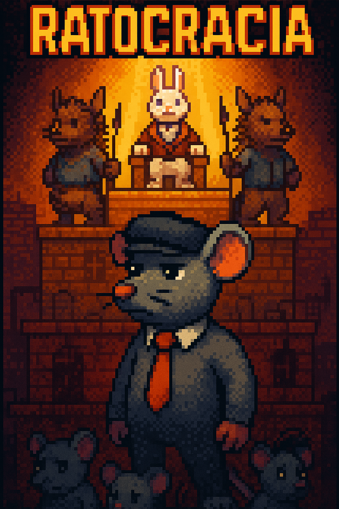

# 🧀 Ratocracia: El Ascenso del Queso Prohibido

> **Un juego de plataformas pixelart donde subir de piso es desafiar al sistema.**

## 🎮 Sinopsis

En una distopía roedora escondida bajo tierra, la sociedad está apilada como una torre vertical, donde cada piso representa una clase social rígida e impenetrable. En lo más bajo vive **Ratticus**, un ratón con corbata y sin miedo. Motivado por los ecos de una antigua resistencia, inicia su ascenso hacia la superficie, donde lo espera el **Gran Conejo Supremo**... y el queso eterno.

---

## 🧱 Niveles

### 🐭 Lv1 – Proletorata
*Las ratas marginadas luchan por sobrevivir.*

- Aprendizaje: movimiento, evasión, sabotaje.  
- Estilo: oscuro, húmedo, ruido industrial.  
- Primer contacto con la resistencia.

### 🦝 Lv2 – Mapachelgrafía
*Los obreros invisibles cargan el sistema en silencio.*

- Habilidades: herramientas robadas, hackeo, subversión.  
- Estilo: mecánico, caótico, con zonas ocultas.  
- Inicio de pequeñas rebeliones.

### 🐿️ Lv3 – Ardillolítica
*La clase media disfruta del confort y la ignorancia política.*

- Mecánicas: disfraces, manipulación, falsificación.  
- Estilo: parques artificiales, drones y oficinas.  
- El enemigo es el papeleo.

### 🐰 Lv4 – Conejurguesía
*El poder vive en el penthouse dorado.*

- Enemigos: Conejos élite y puercoespines guardianes.  
- Objetivo final: ¿tomar el poder o destruir la torre?  
- Decisión narrativa múltiple.

---

## 🎨 Estilo visual y sonoro

- **Pixelart distópico** con detalles humorísticos.  
- **Contraste sonoro**: desde ruido industrial a música estéril y opulenta.  
- **Diálogos** cargados de sarcasmo, filosofía social ligera y referencias roedoras.

---

## 🛠️ Hecho con

- **Game Maker Studio 2**  
- Herramientas de narrativa modular.

---

## 🚧 Estado del proyecto

🚀 En desarrollo –
🎯 Próximamente: Todo (?)

---

  

